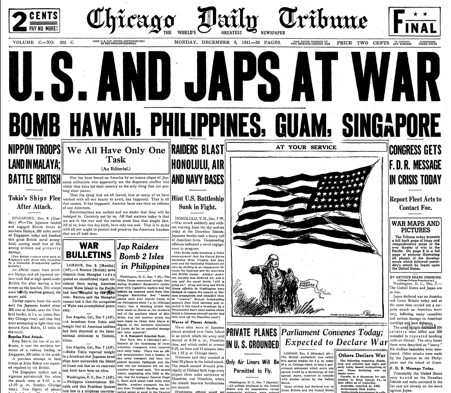

```{r global, include=FALSE}
knitr::opts_chunk$set(echo = TRUE)
library(tidyverse)
library(tidytext)
library(DT)
library(igraph)
library(shinyWidgets)
library(ggraph)
library(gt)
library(textdata)
source("text_analysis.R")
```

```{r import}
pearl_data <- read_rds("data/clean_data.rds")
words_clean <- read_rds("data/words_clean.rds")
ngrams <- read_rds("data/ngrams.rds")
```

# About

## Column {data-width="500"}

### Background

By [Elise Hachfeld](https://github.com/elisefeld) and [Theresa Worden](https://github.com/wordentheresa0)

**The way people consume media has changed dramatically since the 1940s, but has the content itself changed?**

Media is one of the main ways we learn information, so it has a significant capacity to influence public perception. Our research explores how major historical events influence sentiment in the media. Specifically, we examined how the media portrays different ethnic groups as a result of historical events.

For this project, we analyzed the front pages of newspapers for three months before and after the bombing of Pearl Harbor on December 7th, 1941 (from September 7th 1941 to March 7th, 1942.) This time frame allowed us to capture the media response to a critical moment for the United States in World War II.

The data was sourced from the Library of Congress [Chronicling America](https://www.loc.gov/collections/chronicling-america/about-this-collection/) project, a collection containing historical American newspapers from 1756 through 1963.

The data was accessed through the Chronicling America API using the [httr2](https://httr2.r-lib.org) and [jsonlite](https://jeroen.r-universe.dev/jsonlite) packages.

This project was built with flexdashboard and shiny. To view the source code, click [here](https://github.com/elisefeld/loc_ph_data).

------------------------------------------------------------------------

**Further Reading:**

-   See more Pearl Harbor front pages [here](https://www.nypl.org/blog/2017/12/07/pearl-harbor-front-page).

-   [WWII Propaganda: The Influence of Racism](https://cwp.missouri.edu/2012/wwii-propaganda-the-influence-of-racism/)

## Column {data-width="500"}

```{r picture, echo = F, out.width = '100%'}

```

# Overview

## Sidebar {.sidebar}

Here is an overview of the entire data set from 09/07/1941 to 03/07/1942.

You can see the number of articles by several different variables.

------------------------------------------------------------------------

**Insights:**

-   Ethnicities are not very spread out by location, most states have only one of two different ethnicities represented.

-   By far there are the most African American and Jewish newspapers represented in the data set (for newspapers that were associated with an ethnicity.)

-   Several newspapers published articles daily, leading them to have a high count of articles. Note: The Daily Alaska Empire published daily, which could be responsible for the high frequency of the word "Alaska"

-   The most common subjects were location and ethnicity based.

## Column {.tabset .tabset-fade}

### By Language

```{r}
pearl_data |>
  filter(!is.na(language)) |>
  count(language, sort = TRUE) |>
  filter(language != "NA") |>
  ggplot(aes(reorder(language, n), n), fill = language) +
  geom_col() +
  coord_flip() +
  labs(title = "Number of Articles by Language",
       x = "Language",
       y = "Count") +
  theme_minimal()
```

### By Language and State

```{r}
pearl_data |>
  filter(!is.na(language)) |>
  count(language, state, sort = TRUE) |>
  filter(language != "NA") |>
  ggplot(aes(reorder(language, n), n), fill = language) +
  geom_col() +
  coord_flip() +
  labs(title = "Number of Articles by Language and State",
       x = "Language",
       y = "Count") +
  facet_wrap(~state) +
  theme_minimal()
```

### By Ethnicity

```{r}
pearl_data |>
  filter(!is.na(ethnicity)) |>
  count(ethnicity, sort = TRUE) |>
  ggplot(aes(reorder(ethnicity, n), n)) +
  geom_col() +
  coord_flip() +
  labs(title = "Number of Articles by Ethnicity",
       x = "Ethnicity",
       y = "Count") +
  theme_minimal()
```

### By Newspaper

```{r}
pearl_data |>
  filter(!is.na(newspaper)) |>
  count(newspaper, sort = TRUE) |>
  slice_head(n = 25) |>
  ggplot(aes(factor(reorder(newspaper, n)), n)) +
  geom_col() +
  coord_flip() +
  labs(title = "Number of Articles by Newspaper",
       x = "Newspaper",
       y = "Count") +
  theme_minimal()
```

### By Subject

```{r}
data_subjects <- pearl_data |>
  unnest(subject) 

subjects <- data_subjects |>
  distinct(subject) |>
  pull(subject)

data_subjects |>
  count(subject, sort = TRUE) |>
  filter(subject != "united states" & subject != "newspapers") |>
  slice_head(n = 25) |>
  ggplot(aes(reorder(subject, n), n)) +
  geom_col() +
  coord_flip() +
  labs(title = "Number of Articles by Subject",
       x = "Subject",
       y = "Count") +
  theme_minimal()
```

# Common Words

## Sidebar {.sidebar}

Select a newspaper title from the dropdown menu to see how often the 1000 most common words appeared in the front pages of the selected newspaper.

------------------------------------------------------------------------

**Insights:**

-   Both the words War and Japanese became much more common after Pearl Harbor.

-   Japanese doesn't appear in the top 20 words before the attack, while German does not appear in the top 20 words after the attack, showing how the newspaper's focus shifted.

## Column {data-width="500"}

```{r}
keywords_list <- get_keywords_list()
keywords <- get_keywords(words_clean, keywords_list)

inputPanel(
  pickerInput(
    inputId = "newspaper_titles",
    label = "Select Newspaper Title:",
    choices = unique(words_clean$newspaper_title),
    multiple = TRUE,
    options = pickerOptions(actionsBox = TRUE, liveSearch = TRUE)
))

renderTable({
  words_clean |>
    count(word, newspaper_title, sort = TRUE) |>
    head(1000) |>
    filter(newspaper_title %in% c(input$newspaper_titles)) |>
    gt()
})
```

## Row {.tabset .tabset-fade}

### Common Words

```{r}
words_clean |>
  count(word, sort = TRUE) |>
  slice_max(n, n = 20) |>
  ggplot(aes(fct_reorder(word, n), n)) +
  geom_col() +
  coord_flip() +
  labs(title = "Most Common Words in Front Pages of Newspapers",
       subtitle = "September 7th, 1941 to March 7th, 1942",
       x = "Count",
       y = "Word") +
  theme_minimal()
```

### Before and After Pearl Harbor

```{r}
words_clean |>
  count(word, before_pearl_harbor, sort = TRUE) |>
  group_by(before_pearl_harbor) |>
  slice_max(n, n = 20) |>
  ungroup() |>
  ggplot(aes(fct_reorder(word, n), n, fill = before_pearl_harbor)) +
  geom_col(show.legend = FALSE) +
  coord_flip() +
  labs(
    title = "Common Words Before and After Pearl Harbor",
    subtitle = "December 7th, 1941",
    x = "Word",
    y = "Count"
  ) +
  facet_wrap(~before_pearl_harbor, scales = "free") +
  theme_minimal()
```

# Keywords

## Sidebar {.sidebar}

```{r}
inputPanel(
  pickerInput(
    inputId = "ids",
    label = "Select Keywords:",
    choices = unique(keywords$id),
    multiple = TRUE,
    options = pickerOptions(actionsBox = TRUE, liveSearch = TRUE),
    selected = "Nazi"
))
```

Keywords were chosen from several resources, including Library of Congress' [Chronicling America Race and Ethnicity Keyword Thesaurus](https://edsitement.neh.gov/media-resources/race-and-ethnicity-keyword-thesaurus-chronicling-america) and the Houston Holocaust Museum's [Vocabulary List.](https://hmh.org/education/resources/vocabulary-terms-related-holocaust/)

*Please note that many of these words are derogatory terms for ethnic groups that were used at the time, and were included to provide a comprehensive view of the language used towards ethnic groups in the newspapers.*

------------------------------------------------------------------------

**Insights:**

-   The word enemy increased greatly in frequency after the attack on Pearl Harbor.

-   Several words related to Japanese people, including Japanese, Japan and the slur "Jap" also increased in frequency dramatically.

-   Words relating to German people with neutral sentiment (German, Germans) decreased in sentiment, while derogatory terms for German people and German soliders increased *slightly*.

-   Most words relating to the Nazi party also decreased in frequency after Pearl Harbor.

## Column

```{r}
renderPlot({
keywords |>
  filter(id %in% c(input$ids)) |>
  count(word, before_pearl_harbor, sort = TRUE) |>
  ggplot(aes(reorder(word, n), n), fill = before_pearl_harbor) +
  geom_col() +
  coord_flip() +
  labs(title = paste0(input$ids, " Keywords in Front Pages of Newspapers"),
       subtitle = "September 7th, 1941 to March 7th, 1942",
       x = "Count",
       y = "Keyword") +
  theme_minimal() +
  facet_wrap(~before_pearl_harbor)
})
```

# Sentiment Analysis

## Sidebar {.sidebar}

-   The Bing Sentiment Lexicon ranges from -1 to 1, with -1 being the most negative and 1 being the most positive.

-   The Afinn Sentiment Lexicon ranges from -5 to 5, with -5 being the most negative and 5 being the most positive.

-   The NRC Sentiment Lexicon categorizes words into different emotions (Anger, Anticipation, Disgust, Fear, Joy, Negative, Sadness, Surprise, Trust).

    ------------------------------------------------------------------------

**Insights:**

-   Both the Afinn and Bing sentiments were overwhelmingly negative over the entire time period. This suggests that news that is reported is more often bad than good.

-   Both sentiments also appeared to trend more negative over time.

## Row {.tabset .tabset-fade}

### Common Words (Bing Sentiment)

```{r}
result <- analyze_sentiment(data = words_clean, type = "bing")
bing <- result[[1]]
bing_avg <- result[[2]]
bing_date <- result[[3]]

if (nrow(bing) > 0) {
bing |>
  group_by(sentiment, word) |>
  summarize(n = n()) |>
  arrange(sentiment, desc(n)) |>
  group_by(sentiment) |>
  slice_max(n, n = 10) |>
  ungroup() |>
  ggplot(aes(reorder(word, n), n, fill = as.factor(sentiment))) +
  geom_col(show.legend = FALSE) +
  coord_flip() +
facet_wrap( ~ sentiment, scales = "free") +
  labs(
    x = "Word",
    y = "Count",
    title = "Most Common Words by Bing Sentiment",
    subtitle = "Based on the Bing Sentiment Lexicon"
  ) +
  theme_minimal()
} else {
  ggplot() +
    geom_blank() +
    labs(
      title = "No Data Available for Bing Sentiment",
      x = NULL,
      y = NULL
    ) +
    theme_void()
}
```

### Common Words (Afinn Sentiment)

```{r}
result <- analyze_sentiment(data = words_clean, type = "afinn")
afinn <- result[[1]]
afinn_avg <- result[[2]]
afinn_date <- result[[3]]

afinn |>
  group_by(value, word) |>
  summarize(n = n()) |>
  arrange(value, desc(n)) |>
  group_by(value) |>
  slice_max(n, n = 10) |>
  ungroup() |>
  ggplot(aes(reorder(word, n), n, fill = as.factor(value))) +
  geom_col(show.legend = FALSE) +
  coord_flip() +
facet_wrap( ~ value, scales = "free") +
  labs(
    x = "Word",
    y = "Count",
    title = "Most Common Words by Sentiment",
    subtitle = "Based on the Afinn Sentiment Lexicon"
  ) +
  theme_minimal()
```

### NRC Sentiment

```{r}
nrc <- get_sentiments("nrc")
words_clean |>
  inner_join(nrc) |>
  count(word, sentiment, sort = TRUE) |>
  group_by(sentiment) |>
  slice_max(n, n = 10) |>
  ungroup() |> 
ggplot(aes(x = reorder(word, n), y = n, fill = sentiment)) +
  geom_col(show.legend = FALSE) +
  coord_flip() +
  facet_wrap(~ sentiment, scales = "free_y") +
  labs(
    x = "Word",
    y = "Count",
    title = "Top 10 Most Common Words by Sentiment",
    subtitle = "Based on NRC Sentiment Lexicon"
  ) +
  theme_minimal()
```

## Row {.tabset .tabset-fade}

### Bing Sentiment Over Time

```{r}
ggplot(bing_date, aes(x = as.Date(date), y = avg_sentiment, fill = avg_sentiment > 0)) +
  geom_col(show.legend = FALSE) +
    geom_vline(xintercept = as.Date("1941-12-07"), color = "black") +
  labs(
    title = "Average Bing Sentiment Over Time",
    subtitle = "Based on the Bing Sentiment Lexicon",
    x = "Date",
    y = "Average Sentiment",
    caption = "The black line represents the bombing of Pearl Harbor on December 7th, 1941. \n The United States declared war on Japan the next day."
  ) +
  scale_x_date(date_breaks = "1 month", date_labels = "%b %Y") +
  theme_minimal()

```

### Afinn Sentiment Over Time

```{r}
result <- analyze_sentiment(data = words_clean, type = "afinn")
afinn <- result[[1]]
afinn_avg <- result[[2]]
afinn_date <- result[[3]]

ggplot(afinn_date, aes(x = as.Date(date), y = avg_sentiment, fill = avg_sentiment > 0)) +
  geom_col(show.legend = FALSE) +
    geom_vline(xintercept = as.Date("1941-12-07"), color = "black") +
  labs(
    title = "Average Afinn Sentiment Over Time",
    subtitle = "Based on the Afinn Sentiment Lexicon",
    x = "Date",
    y = "Average Sentiment",
    caption = "The black line represents the bombing of Pearl Harbor on December 7th, 1941. \n The United States declared war on Japan the next day."
  ) +
  scale_x_date(date_breaks = "1 month", date_labels = "%b %Y") +
  theme_minimal()
```

# Publishers and Sentiment
## Column {data-width="400"}
### Parameters
```{r}
selectInput(inputId = "state_selector",
            label = "Select State:",
            choices = c("Alaska" = "alaska",
                        "Arizona" = "arizona",
                        "Arkansas" = "arkansas",
                        "California" = "california",
                        "Connecticut" = "connecticut",
                        "District Of Columbia" = "district of columbia",
                        "Florida" = "florida",
                        "Illinois" = "illinois",
                        "Indiana" = "indiana",
                        "Maryland" = "maryland",
                        "Massachusetts" = "massachusetts",
                        "Michigan" = "michigan",
                        "Michigan, New York, Ohio" = "michigan, new york, ohio",
                        "Minnesota" = "minnesota",
                        "Minnesota, Wisconsin" = "minnesota, wisconsin",
                        "Mississippi" = "mississippi",
                        "Montana" = "montana",
                        "Nebraska" = "nebraska",
                        "New York" = "new york",
                        "North Carolina" = "north carolina",
                        "North Carolina, South Carolina" = "north carolina, south carolina",
                        "Ohio" = "ohio",
                        "Ohio, Michigan" = "ohio, michigan",
                        "Virgin Islands" = "virgin islands",
                        "Virginia" = "virginia",
                        "Washington" = "washington",
                        "West Virginia" = "west virginia"),
            selected = "Alaska",
            multiple = FALSE)
selectInput(inputId = "sentiment_selector",
            label = "Select Sentiment:",
            choices = c("Anger" = "anger",
                        "Anticipation" = "anticipation",
                        "Disgust" = "disgust",
                        "Fear" = "fear",
                        "Joy" = "joy",
                        "Negative" = "negative",
                        "Sadness" = "sadness",
                        "Surprise" = "surprise",
                        "Trust" = "trust"),
            selected = "Anger",
            multiple = FALSE)
```

Above, you will find two drop down menus. One is to select a state (or states) from the United States, and the other is to select a category of the NRC Emotion Lexicon. Based on the selection from the drop down menus, a plot showing the word count for newspaper publishers related to the chosen sentiment in the selected state(s).

**Steps taken to gather data:**

-   Gather all words appearing from the front pages of each publication.

-   Assign a sentiment to each word using the NRC Emotion Lexicon, which categorizes words based on various emotions.

-   Organize the words by their respective publishers.

-   Count the frequency of each sentiment across publishers, providing insight into the emotional tone of each publication.

The plot will take each publisher from the selected state and plot the number of times the selected sentiment appears on the front page.

If there is no data for a given combination of "State" and "Sentiment", no plot will be generated.

## Plot


```{r, echo=FALSE}
renderPlot({
  selected_state <- str_to_lower(input$state_selector)
  selected_sentiment <- str_to_lower(input$sentiment_selector)
  
  test <- words_clean |>
    inner_join(nrc, by = "word") |>
    filter(state == selected_state & sentiment == selected_sentiment) |>
    count(newspaper_title, sentiment, sort = TRUE) |>
    group_by(sentiment, newspaper_title) |>
    slice_max(n, n = 10) |>
    ungroup()
  
  
  
  if (nrow(test) == 0) {
    ggplot() +
      geom_blank() +
      labs(title = "No data available for the selected inputs",
           x = NULL,
           y = NULL) +
      theme_void() 
  } else {
    test |>
      ggplot(aes(x = reorder(newspaper_title, n), y = n, fill = sentiment)) +
      geom_col(show.legend = FALSE) +
      coord_flip() +
      facet_wrap(~ sentiment, scales = "free_y") +
      labs(title = paste("Sentiments for Publishers in", str_to_title(selected_state)),
           x = "Publisher",
           y = "Word Count"
      ) +
      theme_minimal()
  }
  
})
```
## Column {data-width="300"}
### Description
To your left, you will find two drop down menus. One is to select a state (or states) from the United States, and the other is to select a category of the NRC Emotion Lexicon. Based on the selection from the drop down menus, a plot showing the word count for newspaper publishers related to the chosen sentiment in the selected state(s).

Steps taken to gather data:

- Gather all words appearing from the front pages of each publication.

- Assign a sentiment to each word using the NRC Emotion Lexicon, which categorizes words based on various emotions.

- Organize the words by their respective publishers.

- Count the frequency of each sentiment across publishers, providing insight into the emotional tone of each publication.

The plot will take each publisher from the selected state and plot the number of times the selected sentiment appears on the front page.

If there is no data for a given combination of "State" and "Sentiment", no plot will be generated.

# Common Phrases

## Column {data-width="300"}

```{r}
dateRangeInput(
    inputId = "date_selector",
    label = "Select Date Range",
    start = "1941-09-07",
    end = "1942-03-07",
    min = "1941-09-07",
    max = "1942-03-07"
  )
```

This section creates a network graph of commonly occurring phrases from the text of the front pages of newspapers from the entire United States. You may filter the range of dates that is taken from the data to see what common phrases were said in the front page during specific days.

Select the dates for which you would like to see, and a plot will generate to the right.

## Column

```{r}
filtered_ngrams <- reactive({
  ngrams |>
    add_count(word) |>
    filter(n >= 75) |>
    filter(date >= as.Date(input$date_selector[1]) & 
           date <= as.Date(input$date_selector[2]))
})

renderPlot({

  ngram_data <- filtered_ngrams()
  
  ngram_graph <- get_ngrams(ngram_data)
  
  set.seed(2017)
  
  ggraph(ngram_graph, layout = "fr") +
    geom_edge_link() +
    geom_node_point() +
    geom_node_text(aes(label = name), vjust = 1, hjust = 1)
})
```
